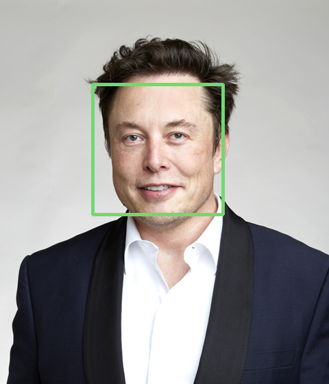
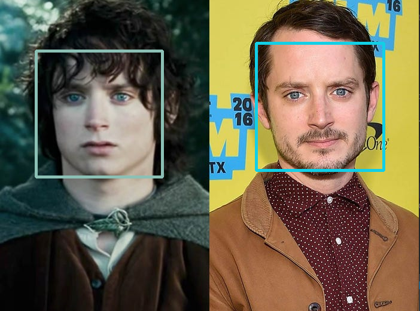
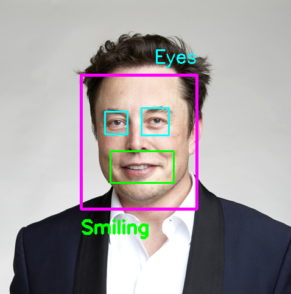

# Face_Smile_Eye_Detection_AI
Real time face, smile and eye detection are done by using Haar Cascade classification. 

## Face Detector
OpenCV and Haar Cascade Classification are used to detect faces. It is the most simple way of detecting a face via artificial intelligence. You may also train your own data with
higher accuracy. This way is one of the most popular manner for detection even in big companies.

  
  
  

## Real Time Detections
The webcam of the PC is used to detect faces, smiles and eyes. You may use the same algorithm to detect something else via Haar Cascade xml files.   

  
  

